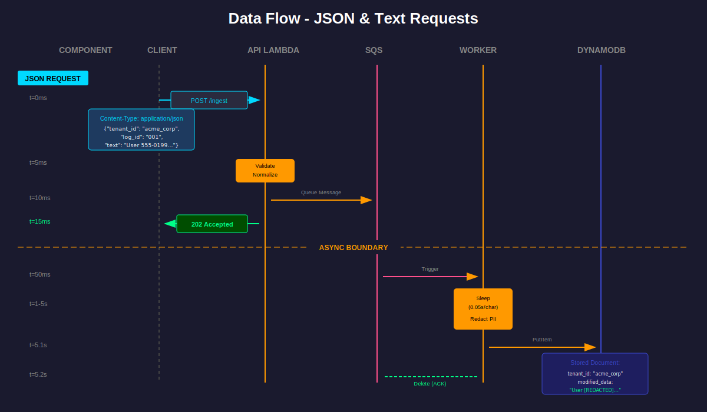

# Robust Data Processor

A scalable, event-driven API backend for ingesting and processing unstructured logs with multi-tenant isolation.

## Features

- **Unified Ingestion**: Accepts both JSON and raw text payloads
- **Instant Response**: Returns 202 Accepted immediately (non-blocking)
- **Async Processing**: SQS-based queue with Worker Lambda
- **Multi-Tenant Isolation**: DynamoDB partition key strategy
- **Crash Recovery**: Automatic retries + Dead Letter Queue
- **Data Redaction**: Sensitive data (phone numbers, emails) automatically redacted

## Architecture


### Data Flow



## Live API

**Base URL**: `https://d6jfovk73cei2a3yfxuql2iyxu0xqbyv.lambda-url.us-east-1.on.aws`

### Endpoints

| Method | Endpoint | Description |
|--------|----------|-------------|
| POST | `/ingest` | Ingest JSON or text data |
| GET | `/health` | Health check |

## API Usage

### JSON Ingestion
```bash
curl -X POST https://d6jfovk73cei2a3yfxuql2iyxu0xqbyv.lambda-url.us-east-1.on.aws/ingest \
  -H "Content-Type: application/json" \
  -d '{
    "tenant_id": "acme_corp",
    "log_id": "log-001",
    "text": "User 555-0199 logged in"
  }'
```

### Text Ingestion
```bash
curl -X POST https://d6jfovk73cei2a3yfxuql2iyxu0xqbyv.lambda-url.us-east-1.on.aws/ingest \
  -H "Content-Type: text/plain" \
  -H "X-Tenant-ID: beta_inc" \
  -d "Error: contact admin@company.com or call 123-456-7890"
```

### Response
```json
{
  "status": "accepted",
  "log_id": "log-001",
  "tenant_id": "acme_corp",
  "message": "Processing queued successfully",
  "message_id": "abc-123"
}
```

## Database Schema

DynamoDB table with multi-tenant isolation using partition keys:

| Field | Type | Description |
|-------|------|-------------|
| `tenant_id` | String (Partition Key) | Tenant identifier |
| `log_id` | String (Sort Key) | Unique log identifier |
| `source` | String | `json_upload` or `text_upload` |
| `original_text` | String | Original input text |
| `modified_data` | String | Text with redacted PII |
| `processed_at` | String | ISO 8601 timestamp |

### Sample Document
```json
{
  "tenant_id": "acme_corp",
  "log_id": "log-001",
  "source": "json_upload",
  "original_text": "User 555-0199 logged in",
  "modified_data": "User [REDACTED] logged in",
  "processed_at": "2025-12-06T22:47:57.559836+00:00"
}
```

## Crash Handling & Resilience

### Failure Scenarios

| Scenario | How It's Handled |
|----------|------------------|
| **API → SQS fails** | Returns 500 with retry hint. Client retries. |
| **Worker crashes mid-process** | Message stays in SQS (visibility timeout). Auto-retry. |
| **DynamoDB write fails** | Worker throws exception → SQS retry. |
| **3 consecutive failures** | Message moves to Dead Letter Queue for inspection. |

### Key Resilience Features

1. **Non-blocking API**: Returns 202 instantly, never waits for processing
2. **SQS Visibility Timeout**: 15 minutes allows long processing without message loss
3. **Dead Letter Queue**: Failed messages preserved for manual inspection
4. **Partial Batch Failures**: `ReportBatchItemFailures` ensures one bad message doesn't block others

### Retry Flow
```
Message in SQS
      │
      ├── Attempt 1: FAIL → Back to queue
      ├── Attempt 2: FAIL → Back to queue  
      ├── Attempt 3: FAIL → Dead Letter Queue
      │
      └── Message preserved for inspection (never lost)
```

## Deployment

### Prerequisites

- AWS CLI configured
- Terraform >= 1.0.0

### Deploy
```bash
cd terraform
terraform init
terraform apply
```

## Project Structure
```
robust-data-processor/
├── src/
│   ├── api/
│   │   ├── app.py              # Flask API
│   │   ├── lambda_handler.py   # Lambda entry point
│   │   └── requirements.txt
│   └── worker/
│       ├── handler.py          # SQS message processor
│       └── requirements.txt
├── terraform/
│   ├── main.tf                 # Provider config
│   ├── variables.tf            # Input variables
│   ├── outputs.tf              # Output values
│   ├── iam.tf                  # IAM roles & policies
│   ├── sqs.tf                  # SQS queues
│   ├── dynamodb.tf             # DynamoDB table
│   ├── lambda_api.tf           # API Lambda
│   └── lambda_worker.tf        # Worker Lambda
├── docs/
│   └── images/                 # Architecture diagrams
└── README.md
```

## Technology Stack

| Component | Technology | Why |
|-----------|------------|-----|
| **API** | AWS Lambda + Flask | Serverless, auto-scales |
| **Queue** | AWS SQS | Managed, reliable, built-in retry |
| **Worker** | AWS Lambda | Event-driven, scales with queue |
| **Database** | AWS DynamoDB | Serverless, partition-key isolation |
| **IaC** | Terraform | Reproducible infrastructure |